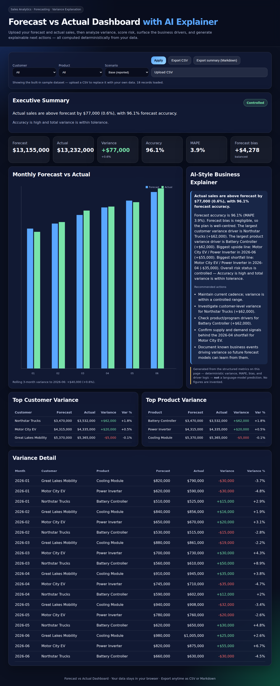

# Forecast vs Actual Dashboard with AI Explainer

A ready-to-use web app for **forecast-vs-actual sales analysis**. Upload your forecast and actual
figures and it computes the variance, forecast accuracy, bias, and risk, ranks the customer and
product drivers, and writes a plain-language explanation with recommended next actions — then lets
you export the results as CSV or a Markdown executive summary.

Everything runs in your browser. There is **no build step, no framework, no server, and no
account** — your data never leaves your machine. It's a single static site backed by one
dependency-free JavaScript module.



## Features

- **Upload your own data** as CSV — it's saved in your browser and restored on your next visit.
- **KPIs**: forecast, actual, variance (absolute & %), forecast accuracy, MAPE, forecast bias.
- **Risk scoring**: each dataset is graded **Controlled / Watch / Critical** with the reason.
- **Driver analysis**: top customer and product variance, biggest single over- and under-runs.
- **Scenario sensitivity**: Base / Optimistic / Downside bands to stress-test the numbers.
- **Rolling 3-month variance** to smooth out single-month noise.
- **AI-style explainer** that turns the metrics into a business narrative and action list —
  generated deterministically from the numbers, so nothing is invented.
- **Exports**: filtered CSV, or a one-click Markdown executive summary.
- **Filters** by customer and product; every metric, chart, and the narrative recompute live.

## Quick start

```bash
npm start        # serves the app at http://localhost:4174
```

That's it — no `npm install` is required, because the app has no dependencies. (`npm install` is
harmless if you prefer to run it.)

You can also open the app by hosting the `public/` folder on any static host — see
[Deploy](#deploy).

> **Setting it up from scratch (or handing it to a coding agent)?** See [`SETUP.md`](SETUP.md) — it
> has step-by-step install instructions and a ready-to-paste prompt for Cowork / Claude Code.

## Use it with your own data

1. Click **Upload CSV** and choose a file with these columns (header row required):

   ```csv
   month,customer,product,forecast,actual
   2026-01,Acme Robotics,Sensor Array,500000,540000
   2026-02,Acme Robotics,Sensor Array,520000,505000
   ```

   - `month` is any sortable label (e.g. `2026-01`).
   - `forecast` and `actual` are numbers (currency values).
   - One row per customer × product × month.

2. Your data is saved locally and reloaded automatically next time. Click **Load sample data** to
   clear it and return to the built-in example.

A small **sample dataset** ships with the app so you can try it immediately. The sample names are
illustrative — replace them with your own data anytime.

## Metrics, briefly

| Metric | Meaning |
| --- | --- |
| **Variance** | `actual − forecast` (absolute and % of forecast) |
| **Forecast accuracy** | `1 − MAPE` — how close the plan was overall |
| **MAPE** | Mean absolute percentage error across line items |
| **Forecast bias** | Signed mean error: positive = under-forecasting, negative = over-forecasting |
| **Rolling 3-month variance** | Variance over a trailing 3-month window |
| **Risk status** | Controlled (≥95% accuracy, ≤3% variance) / Watch / Critical |

Full formulas are in [`ARCHITECTURE.md`](ARCHITECTURE.md).

## The AI explainer, and why you can trust the numbers

The explainer is a **grounded narrative generator**: it only ever describes the metrics computed on
the page (variance, MAPE, bias, drivers, risk). It does not call a language model and does not
predict or invent figures — every sentence maps back to a number you can see. That contract is
stated in the UI and documented in [`ARCHITECTURE.md`](ARCHITECTURE.md).

## Test & lint

```bash
npm test        # unit tests for the analytics core (node --test)
npm run lint    # verifies structure, sample data, and the analytics module
```

## Deploy

The app is a static site in `public/`. Any of these work:

- **GitHub Pages** — the included workflow (`.github/workflows/deploy-pages.yml`) publishes on
  every push to `main`. Enable it under **Settings → Pages → Source: GitHub Actions**.
- **Netlify / Vercel / Cloudflare Pages** — set the publish directory to `public` (no build
  command needed).
- **Any web server** — serve the `public/` folder, or run `npm run build:pages` to stage it into
  `_site/`.

## Optional enhancements

The app is complete for analyzing forecast vs actual. If you want to extend it, natural next steps
are: connecting a live data source (warehouse / API) instead of CSV, adding a forecast-generation
model (time-series / ML) with backtesting, per-region drilldowns, and multi-user hosting with
accounts. See [`ARCHITECTURE.md`](ARCHITECTURE.md) for how the pieces fit.

## Project layout

```
public/
  index.html            Dashboard markup
  styles.css            Styling
  app.js                UI: filters, scenarios, chart, upload, persistence, exports
  forecastAnalytics.js  Analytics + explainer core (runs in browser and Node)
  data/sales.json       Built-in sample dataset
test/                   Unit tests
scripts/                serve, lint, and Pages build (all dependency-free)
```

## License

MIT © Micheal Wolski
